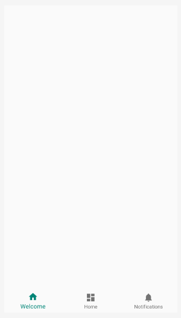

# Tutorial Fragment Android Using Java
## Pendahuluan 

Fragment adalah potongan-potongan dari tampilan yang dapat dapat digunakan berulang-ulang kali pada satu activity maupun activity lain.

Pada penggunaan satu layout aplikasi kita dapat menyatukan beberapa fragment sehingga menjadi tampilan layout multi-pane.

Berikut merupakan contoh tampilan menggunakan fragment multi-pane :


<hr>

## Langkah dan Cara Menerapkan Fragment

<b>A. Mengkonfigurasi Bottom Navigation Bar </b>

1. Siapkan Android Studio anda.
2. Buatlah projek baru
3. Buatlah activity baru dengan layout "Bottom Navigation View"
4. Untuk memodifikasi nama bottom navigation kita dapat melakukan perubahan pada file `menu/bottom_nav_menu.xml`
5. Ubahlah file `menu/bottom_nav_menu.xml` seperti dibawah ini :
```xml
<menu xmlns:android="http://schemas.android.com/apk/res/android">
    <item
        android:id="@+id/navigation_welcome"
        android:icon="@drawable/ic_home_black_24dp"
        android:title="Welcome" />
    <item
        android:id="@+id/navigation_home"
        android:icon="@drawable/ic_dashboard_black_24dp"
        android:title="Home" />
    <item
        android:id="@+id/navigation_notifications"
        android:icon="@drawable/ic_notifications_black_24dp"
        android:title="@string/title_notifications" />
</menu>
```
Penjelasan : pada file tersebut kita juga dapat mengatur id setiap bottom navigation dan icon pada bottom navigation bar tersebut.

6. Jangan lupa modifikasi kode pada layout `MainActivity.java` kalian juga dengan kode seperti berikut` :
```xml
<?xml version="1.0" encoding="utf-8"?>
<androidx.constraintlayout.widget.ConstraintLayout xmlns:android="http://schemas.android.com/apk/res/android"
    xmlns:app="http://schemas.android.com/apk/res-auto"
    xmlns:tools="http://schemas.android.com/tools"
    android:id="@+id/container"
    android:layout_width="match_parent"
    android:layout_height="match_parent"
    tools:context=".MainActivity">

    <FrameLayout
        android:id="@+id/main_frame"
        android:layout_width="match_parent"
        android:layout_height="0dp"
        app:layout_constraintTop_toTopOf="parent"
        app:layout_constraintBottom_toTopOf="@+id/nav_view"/>

    <com.google.android.material.bottomnavigation.BottomNavigationView
        android:id="@+id/nav_view"
        android:layout_width="0dp"
        android:layout_height="wrap_content"
        android:background="?android:attr/windowBackground"
        app:layout_constraintBottom_toBottomOf="parent"
        app:layout_constraintHorizontal_bias="0.0"
        app:layout_constraintLeft_toLeftOf="parent"
        app:layout_constraintRight_toRightOf="parent"
        app:menu="@menu/bottom_nav_menu" />

</androidx.constraintlayout.widget.ConstraintLayout>
```

7. Berikut hasil modified bottom navigation bar yang sudah kita buat :



<hr>
<b>B. Membuat Halaman Fragment Baru </b>


1. Buat fragment baru dengan nama `WelcomeFragment`. Kita dapat membuat fragment baru dengan cara klik kanan new fragment seperti gambar dibawah ini :


2. Sekarang kita dapat mengubah tampilan pada fragment dan mengisi dengan komponen tersedia yang telah dipelajari dipertemuan sebelumnya. Berikut merupakan salah satu kode yang dapat diterapkan
```xml
<?xml version="1.0" encoding="utf-8"?>
<FrameLayout xmlns:android="http://schemas.android.com/apk/res/android"
    xmlns:tools="http://schemas.android.com/tools"
    android:layout_width="match_parent"
    android:layout_height="match_parent"
    xmlns:app="http://schemas.android.com/apk/res-auto"
    tools:context=".HomeFragment">

    <!-- TODO: Update blank fragment layout -->
    <androidx.constraintlayout.widget.ConstraintLayout
        android:layout_width="match_parent"
        android:layout_height="match_parent">

        <TextView
            android:id="@+id/txt_home"
            android:layout_width="match_parent"
            android:layout_height="wrap_content"
            android:textSize="40sp"
            android:text="Home Fragment"
            android:textAlignment="center"
            android:layout_marginTop="8dp"
            app:layout_constraintTop_toTopOf="parent"/>

        <Button
            android:id="@+id/btn_home"
            app:layout_constraintTop_toBottomOf="@id/txt_home"
            android:layout_width="wrap_content"
            android:layout_height="wrap_content"
            android:text="click this button here"
            app:layout_constraintLeft_toLeftOf="parent"
            app:layout_constraintRight_toRightOf="parent"
            android:background="@color/colorPrimary"
            android:textColor="@color/cardview_light_background"
            android:layout_marginTop="8dp"
            android:padding="12dp"
            android:elevation="12dp"/>

    </androidx.constraintlayout.widget.ConstraintLayout>
</FrameLayout>
```
Dengan kode program diatas menghasilkan kode seperti berikut :


❗ ️<b>Exercise : lanjutkan membuat 2 halaman fragment lainnya </b> ❗️
<hr>

<b>C. Menghubungkan fragment dengan activity</b>

1. Pada class `HomeFragment.java` kita perlu menambahkan kode ini pada method `onCreateView()` untuk mengaktifkan tombol supaya dapat diklik :
```java
    @Override
    public View onCreateView(LayoutInflater inflater, ViewGroup container,
                             Bundle savedInstanceState) {
        // Inflate the layout for this fragment
        View view = inflater.inflate(R.layout.fragment_home, container, false);
        txtHome = view.findViewById(R.id.txt_home);
        btnHome = view.findViewById(R.id.btn_home);
        btnHome.setOnClickListener(new View.OnClickListener() {
            @Override
            public void onClick(View v) {
                txtHome.setText("Homepage Activated");
            }
        });

        return view;
    }
```

2. Selanjutnya, kita perlu menambahkan kode berikut di `MainActivity.java` supaya setiap bottom navigation bar yang diklik dapat bekerja dengan baik. Lakukan perubahan seperti berikut :
```java
public class MainActivity extends AppCompatActivity {
    private TextView mTextMessage;

    private BottomNavigationView.OnNavigationItemSelectedListener mOnNavigationItemSelectedListener
            = new BottomNavigationView.OnNavigationItemSelectedListener() {

        @Override
        public boolean onNavigationItemSelected(@NonNull MenuItem item) {
            switch (item.getItemId()) {
                case R.id.navigation_welcome:
                    loadFragment(new HomeFragment());
                    return true;
                case R.id.navigation_home:
                    Toast.makeText(getApplicationContext(), "LET'S CREATE NEW FRAGMENT", Toast.LENGTH_LONG).show();
                    return true;
                case R.id.navigation_notifications:
                    Toast.makeText(getApplicationContext(), "LET'S CREATE NEW FRAGMENT", Toast.LENGTH_LONG).show();
                    return true;
            }
            return false;
        }
    };

    private void loadFragment(Fragment fragment){
        FragmentManager fm = getSupportFragmentManager();
        FragmentTransaction ft = fm.beginTransaction();
        ft.replace(R.id.main_frame, fragment);
        ft.commit();
    }

    @Override
    protected void onCreate(Bundle savedInstanceState) {
        super.onCreate(savedInstanceState);
        setContentView(R.layout.activity_main);
        BottomNavigationView navView = findViewById(R.id.nav_view);
        loadFragment(new WelcomeFragment());
        navView.setOnNavigationItemSelectedListener(mOnNavigationItemSelectedListener);
    }
}
```

3. Silahkan jalankan kode program yang telah anda ketik pada program anda. Dan hasil yang diharapkan adalah seperti berikut : 


<hr>

## Checkpoint 
Kalau kamu sudah berhasil membangun aplikasi android menggunakan fragment, sekarang cobalah mengisi bottom navigation menu yang masih belum terisi, silahkan berkreasi sekreatif mungkin.

<hr>

💻 Happy Coding Everyone! 💻

Follow us at : 

👩 [Azzahra Dinda Shafira](github.com/azzahrads_)

👨 [Rasyid wek mu opo aku gak ero](github.com)